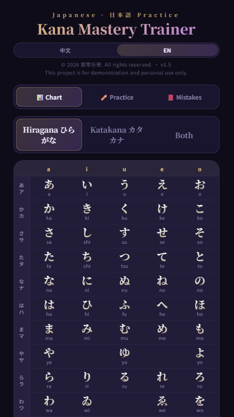
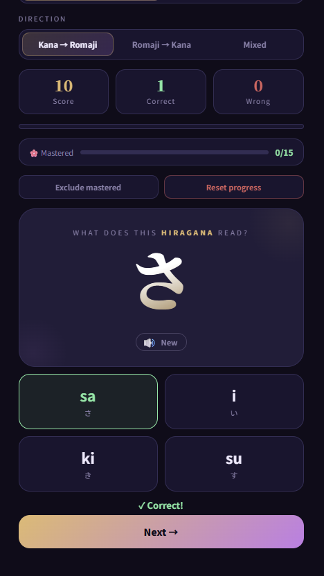
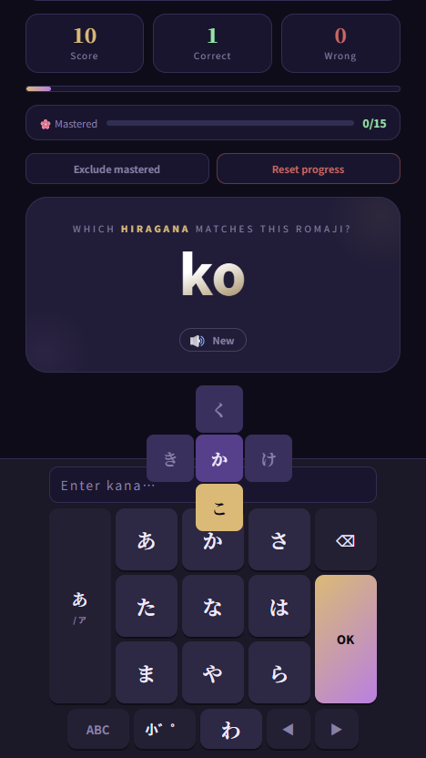
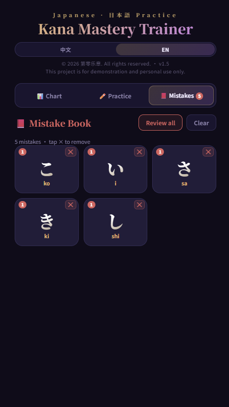

# 🎯 Kana Mastery Trainer · 五十音图强化训练

**[→ Try it live](https://trickshot8.github.io/kana-mastery-trainer/)**

A focused kana training tool designed to break the **"almost familiar but not really memorized"** stage.

Built from a real learning need — for learners who have seen hiragana/katakana before but struggle to recall them accurately and quickly.

---

## ✨ Why this exists

Many tools (like Duolingo) help you get familiar with kana, but leave you stuck here:

> "Looks familiar, but can't recall instantly."

This tool is designed specifically to push you through that wall — from recognition to automatic recall.

---

## 🚀 Features

### Practice
- **Multiple choice + Fill-in modes** — fill-in uses a custom QWERTY or flick keyboard (no system keyboard interference)
- **Bidirectional training** — Kana → Romaji, Romaji → Kana, or Mixed
- **Hiragana & Katakana** — including voiced (dakuten/handakuten) rows, with quick-select toggles
- **Confuse-pair hints** — 55 common mix-up pairs (e.g. ソ vs ン, シ vs ツ) with explanations on wrong answers

### Learning System
- **SRS (Spaced Repetition)** — each kana has an individual score; mastered characters follow a [0, 1, 3, 7, 14, 30] day review schedule
- **Speed-based scoring** — answering quickly earns a ×1.5 score bonus (⚡); slow answers reduce gains
- **Mastery badges** — New / Practicing / Getting there / Almost / Needs work / 🌸 Review / 🌸 Mastered
- **Mistake book** — wrong answers are automatically logged, highlighted red in the kana chart, and removed when mastered

### Interface
- **Bilingual UI** — full Chinese / English support including all 55 confuse-pair explanations
- **Kana chart** — full hiragana + katakana reference with mistake highlighting
- **Mobile-first** — custom flick keyboard with tap-cycle and swipe-to-select; works on desktop too

---

## 🧭 Who is this for?

- Learners who already have **basic exposure to kana** but can't recall reliably
- People stuck in the **"almost memorized" stage**
- Anyone who wants to **master kana in a few days of focused practice**

---

## 📸 Screenshots

### Home

### Practice

### Mistakes

---

## 🛠️ Tech Stack

- Pure HTML / CSS / JavaScript — single file, no framework, no build step
- All progress stored in `localStorage` — no server, no account needed
- Fonts: Noto Serif JP / Noto Sans JP (Google Fonts) + PingFang SC (system)

**AI-assisted development**
- Concept and Japanese learning methodology: ChatGPT
- UI/UX design, SRS system, and full implementation: Claude (Anthropic)

---

## 🧠 Design Philosophy

This is not a full language learning app.

It's a **learning bottleneck breaker** — designed to move you from recognition → accurate recall → automatic response.

No gamification, no streaks, no forced progression. Just focused drills and honest feedback on what you actually know.

---

## 🌱 Roadmap

- [ ] Desktop layout polish (native keyboard for fill-in on desktop)
- [ ] Writing / stroke recognition practice
- [ ] Expand to vocabulary and kanji

---

## 📄 License

© 2026 第零乐章. All rights reserved.  
This project is for demonstration and personal use only.
